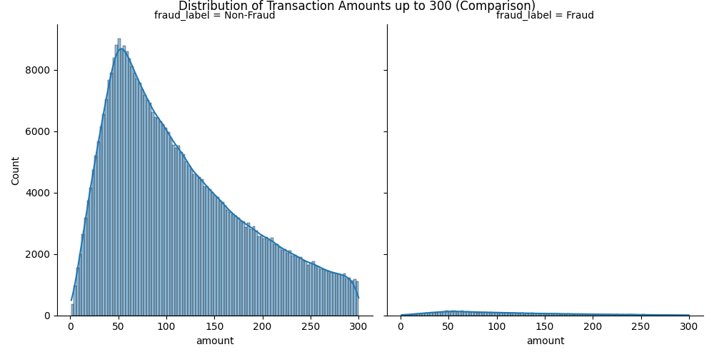
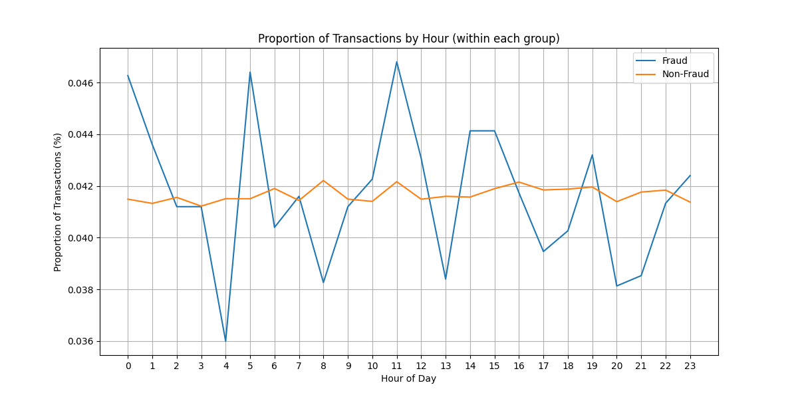
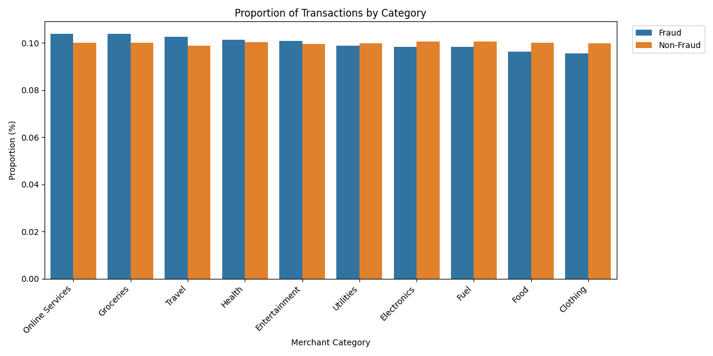

# Credit Card Fraud Transaction Analysis

## 1. Project Goal

The primary goal of this project is to perform an Exploratory Data Analysis (EDA) on a credit card transaction dataset. The objective is to identify key features and patterns that distinguish fraudulent transactions from legitimate ones.

**Main Hypotheses Tested:**
- Is there a correlation between the transaction `Amount` and the likelihood of fraud?
- Are there specific temporal patterns (e.g., time of day) associated with fraudulent activities?
- Do certain `Merchant_Category` entries show a higher risk of fraud?

## 2. Data Source

- **Credit Card Fraud 2025 Dataset:** [https://www.kaggle.com/datasets/prince7489/credit-card-fraud-2025](https://www.kaggle.com/datasets/prince7489/credit-card-fraud-2025)

## 3. Key Findings & Insights

1.  **Transaction `Amount` is a Weak Indicator of Fraud.**
    - The distribution of transaction amounts for the majority of fraudulent and legitimate operations is very similar. This suggests that fraudsters effectively disguise their activities as typical, low-value purchases to avoid immediate suspicion.
 

2.  **Time of Day (`Hour_of_Day`) is a VERY STRONG Indicator of Fraud.**
    - A clear pattern was discovered: the proportion of fraudulent transactions is **disproportionately high during the night** (especially between 00:00 and 06:00 AM). In contrast, the activity of legitimate users is minimal at this time. This strongly suggests that fraudsters prefer to operate when victims are most likely asleep and unable to react quickly.
 

3.  **`Merchant_Category` is a Weak but Noticeable Indicator.**
    - Categories such as `Online Services`, `Travel` and `Groceries` exhibit a **disproportionately higher share** of fraudulent transactions compared to their share in legitimate transactions. This marks them as higher-risk categories that may require closer monitoring by fraud detection systems.
 

## 4. Tools Used

